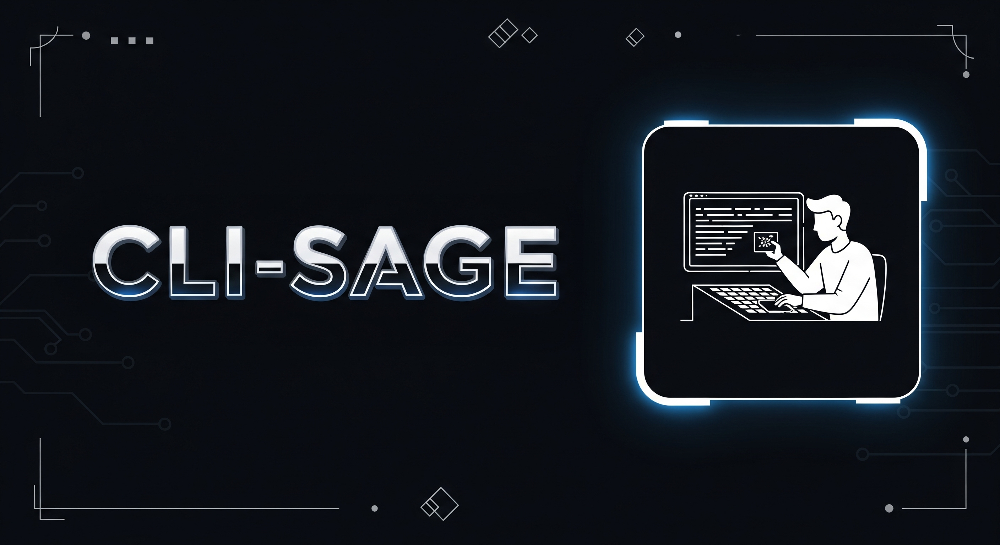

# 👨‍💻 CLI-Sage - AI Powered Command Line Tool 👨‍💻


CLI-Sage is a command line tool that uses AI to help you with various tasks. It can assist with code debugging, command suggestions, document lookup and more. The tool is designed to be easy to use and integrate into your workflow.

## Features🚀
- AI Powered error debugging.
- Fast documentation search for programming languages
- Get command suggestions based on your command history
- Use RAG to answer questions about the indexed knowledge base

## Technology Stack🚀
- **Python 3.13**
- **[uv](https://docs.astral.sh/uv/)** package management
- **Langchain** for LLM and vector store integration
- **Gemini AI** for llm inference
- **ChromeDB** for vector storage

## Installation🚀
- Setup `.env` file:
```sh
cp .env.example .env
```
- Edit the `.env` file to configure the following environment variables:
  - `GEMINI_API_KEY`: Your Gemini API key.
  - `KNOWLEDGE_BASE_URL`: The URL of the knowledge base app (e.g., `http://localhost:4000` if running locally).
  - `MODEL_NAME`: The name of the model you want to use (e.g., `gemini-2.0-flash`).
  - MODEL_PROVIDER: The provider of the model you want to use (e.g., `google_genai`).
- Install the `uv` package manager: https://docs.astral.sh/uv/getting-started/installation/
- Change directory to cli-sage:
```sh
cd cli-sage
```
- Install the package using `uv`:
```sh
uv sync
```
- Run the CLI tool:
```sh
bin/cli-sage
```
---
**To install globally, do the following steps:**\
Add the following to your `.bashrc` or `.zshrc` file to set up the environment:
```sh
export PATH=/PATH_TO_INSTALLATION/bin/:$PATH
```
Run cli-sage from the command line:
```sh
cli-sage
```
---
## Team🚀
> Our Contributors

<!-- prettier-ignore -->
| [<br /><sub><b>👨‍💻vpk11👨‍💻</b></sub>](https://wwww.github.com/vpk11)<br /> |
| :---: |

---

## References🚀
- [Python 3.13 Documentation](https://docs.python.org/3.13/)
- [Langchain Documentation](https://python.langchain.com/docs/introduction/)
- [Gemini AI Documentation](https://ai.google.dev/gemini-api/docs)
- [uv Documentation](https://docs.astral.sh/uv/)